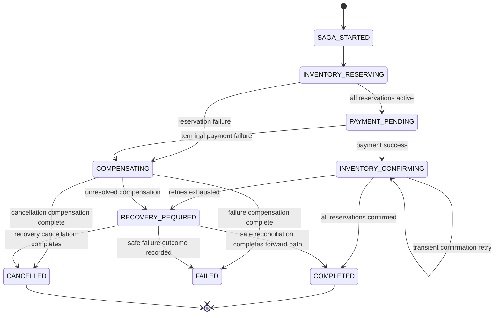

# Final Saga and Kafka Architecture Contract

**Status:** Final approved architecture contract for implementation planning.

**Implementation status:** Saga, Kafka, Outbox, retries, compensation, recovery, reservation expiry, and the approved service-to-service authentication mechanism have **not yet been implemented**. Every future rule in this document is marked **APPROVED DESIGN - NOT YET IMPLEMENTED** where it differs from the current code.

This document freezes the 27 approved architecture decisions supplied by the team. It is the implementation source of truth for those decisions. Existing documents remain useful for detailed current contracts and analysis; where they describe current behavior or an earlier proposal, this document explicitly identifies the difference.

## 1. Purpose and Scope

The platform uses an Order-centered orchestration Saga for checkout. The contract defines:

- Order, Inventory, Payment, Product, Cart, User, and Notification boundaries.
- The final relationship between existing Order statuses and Saga states.
- Synchronous REST responsibilities and asynchronous Kafka events.
- Durable Saga state, transactional Outbox, retries, idempotency, compensation, recovery, authentication, and observability rules.
- Implementation guardrails for the later coding phase.

This is a design contract only. It does not change Java code, APIs, database schemas, configuration, Kafka infrastructure, or tests.

## 2. Current Implementation Baseline

The current codebase is synchronous and Order-led:

```text
Client -> API Gateway -> Order
                         -> User validation
                         -> Cart snapshot
                         -> Product validation
                         -> Inventory reservation
                         -> local Order persistence
                         -> Payment creation
```

Current facts:

- Order creates new Orders with status `PENDING`.
- The current Order flow reserves Inventory but does not call Inventory confirmation.
- Current Order does not persist reservation IDs per Order item.
- Current Order does not persist Payment ID.
- Current Order forwards an incoming user JWT to several REST clients when present.
- Payment currently creates mock payments immediately as `SUCCESS`.
- Payment has a local refund endpoint, but Order does not call it.
- Inventory already has reservation-ID-based reserve, release, and confirmation REST operations.
- Current Inventory repeated release/confirmation operations are rejected as invalid state; future idempotent behavior below is not implemented.
- Notification is currently a synchronous CRUD service and has no Kafka consumer.
- No Kafka producer, consumer, topic, Outbox, Saga state store, retry scheduler, DLT, or recovery workflow exists.

The current implementation and existing documents are not silently changed by this contract.

## 3. Final Architecture Overview

**APPROVED DESIGN - NOT YET IMPLEMENTED**

The final architecture is a hybrid REST/Kafka orchestration:

```text
Client
  -> API Gateway (external JWT authentication)
  -> Order (Saga coordinator)
       -> REST User validation
       -> REST Cart snapshot/validation
       -> REST Product validation and authoritative price
       -> REST Inventory reserve
       -> REST Payment
       -> REST Inventory confirm/release
       -> Order state + Outbox transaction
  -> Kafka domain events
       -> Notification consumes OrderCompleted
```

Kafka is used for asynchronous domain events and downstream notification. Immediate request/response operations remain REST. Kafka does not replace every service interaction.

## 4. Saga Ownership and Boundaries

| Service | Final responsibility | Saga relationship |
|---|---|---|
| Order | Owns Order and durable Saga state; coordinates checkout, compensation, and recovery | Saga coordinator |
| Inventory | Owns stock and reservation state; reserves, confirms, releases, and expires reservations | Reservation/confirmation participant |
| Payment | Owns payment and refund state plus payment idempotency records | Payment/refund participant |
| Notification | Consumes `OrderCompleted` and handles notification delivery independently | Outside the core Saga |
| Product | Owns catalog and authoritative product price | Supporting validation service |
| Cart | Owns active cart and provides checkout snapshot input | Supporting snapshot/validation service |
| User | Owns identity, account status, and user authorization | Supporting identity service |

There is no separate Saga database or schema. Order owns the Saga state in `order_schema`; Inventory and Payment retain their own participant state.

## 5. Final Saga State Machine

**APPROVED DESIGN - NOT YET IMPLEMENTED**

| Saga state | Meaning | Order status mapping | Terminal? |
|---|---|---|---|
| `SAGA_STARTED` | Order validation and Saga initialization completed | `PENDING` | No |
| `INVENTORY_RESERVING` | Item reservations are being requested | `PENDING` | No |
| `PAYMENT_PENDING` | Required reservations are active and payment is pending/in progress | `PENDING` | No |
| `INVENTORY_CONFIRMING` | Payment succeeded and exact reservations are being confirmed | `PENDING` | No |
| `COMPLETED` | Payment succeeded and every required reservation was confirmed | `CONFIRMED` | Yes |
| `COMPENSATING` | Participant effects are being reversed after a failure or cancellation | `PENDING` | No |
| `FAILED` | Saga failed after required compensation/recovery handling | `CANCELLED` | Yes |
| `CANCELLED` | Cancellation completed according to state-aware rules | `CANCELLED` | Yes |
| `RECOVERY_REQUIRED` | Automatic recovery cannot safely determine or resolve participant state | `PENDING` | No |

`CONFIRMED` means successful completion of the complete Saga: payment succeeded and all required Inventory reservations were confirmed. `PAID` may represent a payment milestone but is not equivalent to Saga completion. Existing `CREATED` and `PAID` statuses are retained; their current usage remains limited or ambiguous.



## 6. Order Status Mapping

**APPROVED DESIGN - NOT YET IMPLEMENTED**

| Saga state | Existing Order status |
|---|---|
| `SAGA_STARTED` | `PENDING` |
| `INVENTORY_RESERVING` | `PENDING` |
| `PAYMENT_PENDING` | `PENDING` |
| `INVENTORY_CONFIRMING` | `PENDING` |
| `COMPLETED` | `CONFIRMED` |
| `COMPENSATING` | `PENDING` |
| `FAILED` | `CANCELLED` |
| `CANCELLED` | `CANCELLED` |
| `RECOVERY_REQUIRED` | `PENDING` |

Current implementation caveat:

- `PENDING` is currently assigned during Order creation and remains after current mock Payment success.
- `CONFIRMED` is currently only an existing enum value and can be assigned through the generic status endpoint; no current Saga completion transition sets it.
- `PAID` remains available as an existing status and may identify a payment milestone, but must not identify completed Saga success.
- `CREATED` remains available, but current checkout does not automatically assign it.
- Current `CANCELLED` is a local status update and does not prove compensation completion.

## 7. Inventory Reservation Lifecycle

**APPROVED DESIGN - NOT YET IMPLEMENTED**

Each Order item has one reservation reference. The lifecycle is:

```text
ACTIVE -> CONFIRMED
ACTIVE -> RELEASED
```

Rules:

- Inventory creates an `ACTIVE` reservation with a generated `reservationId`.
- `reservationId` is the exact identity used for confirmation and release.
- `orderId` and correlation fields associate the participant operation with the Saga.
- `ACTIVE -> CONFIRMED` consumes the reserved stock exactly once.
- `ACTIVE -> RELEASED` returns the held quantity to available stock.
- `CONFIRMED -> CONFIRMED` returns the existing successful result without another stock decrement.
- `RELEASED -> RELEASED` returns the existing successful result without stock mutation.
- `RELEASED -> CONFIRMED` is a business conflict.
- `CONFIRMED -> RELEASED` is a business conflict.
- A missing reservation returns `RESERVATION_NOT_FOUND`.
- Confirm/release races are serialized and reconciled so both terminal states cannot occur.

The current Inventory implementation has the reservation ID, local locking, and one-way transitions, but currently rejects repeated same-operation requests rather than returning an existing result. Idempotent behavior is approved future behavior.

## 8. Payment Lifecycle and Idempotency

**APPROVED DESIGN - NOT YET IMPLEMENTED**

Payment owns payment and refund state. Payment operations use a unique idempotency key tied to the Saga/order payment operation.

- A repeated payment command with the same idempotency key returns the existing result and does not create a duplicate payment.
- A refund has its own idempotency key.
- A repeated refund command with the same refund idempotency key returns the existing result and does not perform a duplicate refund.
- Payment ID/reference is persisted by Payment and recorded by Order Saga state.
- Payment success is a milestone; it is not Order completion.
- Refund is compensation and is separate from normal payment success.

Current implementation caveat:

- The current mock creates and persists a generated Payment ID as `SUCCESS`.
- Current Payment accepts no idempotency key and can create duplicate records for repeated requests.
- Current refund changes `SUCCESS` to `REFUNDED`, but repeated refund requests fail rather than returning the prior result.
- Current Order does not store the Payment ID or invoke refund.

## 9. Cancellation and Compensation

**APPROVED DESIGN - NOT YET IMPLEMENTED**

Cancellation is state-aware:

| Current Saga state | Rule |
|---|---|
| `SAGA_STARTED` | Cancel immediately. |
| `INVENTORY_RESERVING` | Stop new reservations and compensate existing `ACTIVE` reservations. |
| `PAYMENT_PENDING` | Stop or resolve payment and release `ACTIVE` reservations. |
| `INVENTORY_CONFIRMING` | Do not blindly cancel; finish or reconcile the current operation first. |
| `COMPLETED` | Normal Saga cancellation is not allowed; use a future refund/return workflow. |
| `COMPENSATING` | Do not start a second independent compensation; allow the current compensation to finish. |
| `FAILED` / `CANCELLED` | Terminal. |
| `RECOVERY_REQUIRED` | Treat cancellation as a recovery request and reconcile actual participant state first. |

For compensation after payment success and confirmation failure:

```text
RECONCILE INVENTORY
  -> RELEASE ACTIVE RESERVATION
  -> REFUND PAYMENT
  -> finish only when both results are durably recorded
```

Never release a reservation if reconciliation shows it is already `CONFIRMED`. If either release or refund remains unresolved, the Saga remains `RECOVERY_REQUIRED`.

## 10. Recovery Strategy

**APPROVED DESIGN - NOT YET IMPLEMENTED**

Recovery is hybrid:

1. Automatic recovery runs first.
2. Order/Saga coordinator reconciles actual Inventory and Payment state.
3. The coordinator determines whether the forward path can complete safely or compensation is required.
4. Compensation releases only reservations confirmed by reconciliation to be `ACTIVE`.
5. Payment refund is performed only for a confirmed successful payment when compensation requires it.
6. The workflow finishes only after release and refund outcomes are durably recorded.
7. If state remains unknown or an operation cannot be resolved safely, enter `RECOVERY_REQUIRED`.
8. Manual intervention is used only when automatic recovery cannot safely resolve the state.

No full admin UI is required. A protected internal/admin recovery endpoint may be considered later, but is not part of this document’s implementation.

## 11. Retry and Timeout Policies

**APPROVED DESIGN - NOT YET IMPLEMENTED**

### Inventory confirmation

Three total attempts:

| Attempt | Timing |
|---|---|
| 1 | Immediate |
| 2 | After 2 seconds |
| 3 | After 5 seconds |

Retry only technical/transient failures such as timeout, connection failure, or temporary 5xx/infrastructure failure. Do not retry deterministic failures such as `RESERVATION_NOT_FOUND`, invalid reservation state, or invalid request. A timeout does not automatically prove that confirmation failed. Reconcile after retry exhaustion before compensation.

### Overall Saga timeout

Overall timeout is 10 minutes. Monitor these non-terminal states:

- `SAGA_STARTED`
- `INVENTORY_RESERVING`
- `PAYMENT_PENDING`
- `INVENTORY_CONFIRMING`
- `COMPENSATING`

Do not time out `COMPLETED`, `FAILED`, or `CANCELLED`. `RECOVERY_REQUIRED` is already a recovery state. Timeout triggers reconciliation, then completion, compensation, or continued recovery; it must not blindly cancel, refund, or release.

### Kafka consumer retry

Consumer technical/transient failures use three attempts at 0, 2, and 5 seconds. Permanent invalid event, unsupported version, and permanent business validation failures go to the appropriate DLT after retry policy. DLT does not automatically mean Saga success or failure.

## 12. Kafka Architecture

**APPROVED DESIGN - NOT YET IMPLEMENTED**

Kafka carries asynchronous domain events and downstream integration. Commands and events remain conceptually different even when transport implementation carries both through Kafka-related infrastructure.

Domain-oriented topics:

- `order.events`
- `inventory.events`
- `payment.events`

Past-tense domain events include:

- `OrderCheckoutStarted`
- `InventoryReserved`
- `InventoryReservationFailed`
- `InventoryReleased`
- `InventoryConfirmed`
- `PaymentSucceeded`
- `PaymentFailed`
- `PaymentRefunded`
- `OrderCompleted`
- `OrderCancelled`

Kafka delivery is at least once. Duplicate events are expected and consumers must use durable deduplication.

## 13. Kafka Topics, Keys and Partitions

**APPROVED DESIGN - NOT YET IMPLEMENTED**

- Kafka key: `orderId`.
- Development retention: 7 days.
- Development partitions: 3 per topic.
- DLT examples: `order.events.DLT`, `inventory.events.DLT`, and `payment.events.DLT`.
- The same `orderId` maps to the same partition within a topic.
- Global ordering across different topics must not be assumed.
- Business ordering is enforced by Saga state, durable Saga state, and participant state.
- `sagaId` is correlation data, not the Kafka partition key.
- Logically independent consumers use separate consumer groups.

## 14. Event Envelope and Versioning

**APPROVED DESIGN - NOT YET IMPLEMENTED**

All events use a common versioned envelope:

```json
{
  "eventId": "uuid",
  "eventType": "InventoryReserved",
  "version": 1,
  "sagaId": "uuid",
  "orderId": "uuid",
  "occurredAt": "timestamp",
  "payload": {}
}
```

Rules:

- Version starts at `1`.
- Payload contains only fields required by consumers.
- Entire service entities are not copied into every event.
- `eventId`, `sagaId`, and `orderId` are common correlation fields.
- `reservationId` is included where Inventory is involved.
- Payment ID/reference is included where Payment is involved.
- No Schema Registry is required for the current semester project.

## 15. Consumer Retry and DLT

**APPROVED DESIGN - NOT YET IMPLEMENTED**

Consumers retry technical/transient errors three times at 0, 2, and 5 seconds. Examples include temporary database, network, infrastructure, and Kafka failures.

Permanent failures such as invalid event, unsupported version, or permanent business validation failure go to the appropriate DLT. DLT handling is explicit and operational; it does not itself change the Saga outcome.

Consumers must be idempotent. They process and persist the result, persist duplicate-tracking information as required, and acknowledge/commit the Kafka offset only after the required local work is complete.

## 16. Transactional Outbox

**APPROVED DESIGN - NOT YET IMPLEMENTED**

Order/Saga state changes and the corresponding Outbox event are written in the same Order database transaction.

A separate publisher reads pending Outbox records and publishes them to Kafka:

```text
PENDING -> publish to Kafka -> PUBLISHED
```

Temporary Kafka failure leaves the event `PENDING`; the publisher retries later. Kafka failure does not fail or roll back the business transaction.

If the publisher crashes after Kafka receives the event but before `PUBLISHED` is recorded, a duplicate event may be published. Consumer idempotency handles that condition. No PostgreSQL/Kafka distributed transaction is used.

## 17. Database Transaction Boundaries

**APPROVED DESIGN - NOT YET IMPLEMENTED**

Each service owns its local database transaction. No transaction crosses service boundaries.

- Order: Order/Saga state and Outbox event are one local transaction.
- Inventory: reservation, confirmation, release, and expiry changes are atomic locally.
- Payment: payment/refund state and idempotency records are atomic locally.
- REST calls must not hold long-running caller database transactions open while waiting for another service.
- Kafka publishing occurs outside the business database transaction through the Outbox publisher.
- No distributed transactions, two-phase commit, cross-service database transaction, or PostgreSQL/Kafka distributed transaction.

Cross-service consistency comes from Saga coordination, local transactions, Outbox, retries, idempotency, compensation, and recovery.

## 18. REST vs Kafka Responsibilities

**APPROVED DESIGN - NOT YET IMPLEMENTED**

Synchronous REST remains appropriate for immediate request/response operations:

- Product validation
- User validation
- Cart snapshot and validation
- Inventory reserve
- Inventory confirm
- Inventory release
- Payment
- Refund

Kafka is used for asynchronous domain events and downstream Notification. REST Saga operations still require timeout, retry, idempotency, correlation, and durable state.

## 19. Price Snapshot Semantics

**APPROVED DESIGN - NOT YET IMPLEMENTED**

Product Service is authoritative for price at checkout. At Saga start:

1. Order revalidates every product through Product Service.
2. Order obtains the current authoritative price.
3. Order copies that price into an immutable OrderItem/Saga snapshot.
4. Payment uses the snapshot.
5. The price does not change during the active Saga.

Client-provided price is never trusted. Cart price is only a cart-time snapshot/display value. If Product price changed since Cart, checkout uses and persists the current Product price, may inform the client, and does not fail solely because of the price change.

## 20. Service-to-Service Authentication

**APPROVED DESIGN - NOT YET IMPLEMENTED**

- Keep Gateway JWT authentication for external/user requests.
- Keep the existing `X-Internal-Service-Secret` for the existing Cart -> User internal endpoint.
- Do not treat a forwarded user JWT as sufficient service identity.
- Introduce a simple dedicated service-to-service credential mechanism for future Saga REST calls.
- Do not introduce mTLS or service-mesh complexity for this semester project.
- No authentication implementation changes are part of this documentation task.

Current baseline: User independently validates JWTs, while most other downstream services do not independently authenticate requests. The existing internal secret is currently limited to the User internal endpoint and remains in place for that use.

## 21. Notification Contract

**APPROVED DESIGN - NOT YET IMPLEMENTED**

Notification consumes `OrderCompleted` from `order.events` using the common event envelope. The payload contains only fields Notification needs.

Notification uses three attempts at 0, 2, and 5 seconds. Permanent invalid event, unsupported version, or business validation failure goes to `order.events.DLT`. Notification deduplicates by `eventId`.

Notification failure does not change:

```text
Order = CONFIRMED
Saga = COMPLETED
```

Notification does not release Inventory, refund Payment, cancel Order, or move the Saga out of `COMPLETED`.

## 22. Observability and Correlation

**APPROVED DESIGN - NOT YET IMPLEMENTED**

Use structured correlation logging. Primary fields:

- `sagaId`
- `orderId`
- `eventId` for every Kafka event
- `reservationId` for Inventory operations
- Payment ID
- idempotency key
- retry attempt

Failures and recovery information are logged. No separate observability platform is required for the semester project. Never log passwords, JWTs, payment credentials, or secrets.

## 23. Reservation Expiry

**APPROVED DESIGN - NOT YET IMPLEMENTED**

- Reservation expiry is 15 minutes.
- Inventory Service owns expiry.
- An `ACTIVE` reservation older than 15 minutes becomes eligible for automatic release.
- Expiry produces `RELEASED`; no `EXPIRED` reservation state is introduced.
- Confirmation versus expiry is serialized so only one terminal transition succeeds.
- If Payment succeeded and compensation is required, reconcile, release an `ACTIVE` reservation, and refund Payment.

## 24. End-to-End Happy Path

**APPROVED DESIGN - NOT YET IMPLEMENTED**

```text
Client -> Gateway with user JWT
  -> Order validates User and snapshots Cart
  -> Order validates Product and current price
  -> Order creates SAGA_STARTED / PENDING state and Outbox event
  -> Inventory reserves each item
  -> Order persists one reservationId per OrderItem
  -> Payment processes using payment idempotency key
  -> Order records Payment ID/reference
  -> Inventory confirms each reservationId
  -> Order sets Saga COMPLETED and Order CONFIRMED
  -> Order writes OrderCompleted to Outbox
  -> Outbox publisher sends order.events
  -> Notification consumes OrderCompleted independently
```

No current implementation performs all of these steps. This is the approved future flow.

## 25. End-to-End Failure Paths

**APPROVED DESIGN - NOT YET IMPLEMENTED**

### Reservation failure

Stop new reservations, release every previously successful `ACTIVE` reservation by exact `reservationId`, and record the outcome. The Saga becomes `FAILED` with Order `CANCELLED` only after required compensation is durably resolved; unresolved work enters `RECOVERY_REQUIRED`.

### Payment failure

A terminal payment failure releases all `ACTIVE` reservations. No refund is required when payment did not succeed. Retry only according to the approved payment retry/idempotency rules.

### Payment success and confirmation failure

```text
Retry confirmation
  -> reconcile actual reservation state
  -> if all confirmed, complete Saga
  -> otherwise release only ACTIVE reservations
  -> refund successful Payment
  -> finish only after both outcomes are recorded
  -> unresolved result means RECOVERY_REQUIRED
```

Do not immediately refund after the first confirmation failure. Never release a reservation that reconciliation shows as `CONFIRMED`.

### Notification failure

Notification retries independently and uses DLT. It cannot undo `Order = CONFIRMED` or `Saga = COMPLETED`.

## 26. Final Invariants

1. Order Service is the Saga coordinator.
2. Inventory is the reservation/confirmation participant.
3. Payment is the payment/refund participant.
4. Notification is outside the core Saga.
5. Saga state is durable in Order Service.
6. Each OrderItem has its own `reservationId`.
7. An Inventory reservation cannot be both `RELEASED` and `CONFIRMED`.
8. Inventory confirmation cannot double-decrement stock.
9. Payment success does not equal Saga completion.
10. Saga completes only after required Inventory confirmations succeed.
11. A failed or cancelled Saga cannot report success.
12. Compensation is based on actual participant state.
13. Recovery cannot blindly mark complete, refund, or release.
14. Notification failure cannot undo a completed business transaction.
15. Duplicate Kafka events are safe.
16. Outbox protects database-to-Kafka reliability.
17. No distributed transaction is required.
18. Correlation IDs allow the complete Saga to be traced.

## 27. Implementation Guardrails

The later implementation must:

- Preserve existing Order status enum values, including `CREATED` and `PAID`.
- Treat the approved mapping as a Saga-to-existing-status mapping, not as permission to silently change current API behavior before implementation work is approved.
- Persist Saga state and participant references in Order Service/order schema; do not create a separate Saga database/schema.
- Keep Product, User, Cart, reserve, confirm, release, Payment, and refund as REST responsibilities.
- Use exact `reservationId` values for Inventory confirmation, release, reconciliation, and compensation.
- Never use ambiguous product/quantity compensation for an Order reservation.
- Use idempotency keys and durable duplicate tracking for participant operations and events.
- Use the common event envelope and `orderId` Kafka key.
- Use Outbox for Order state/event atomicity.
- Avoid long-running cross-service database transactions.
- Reconcile before compensation after confirmation timeout or retry exhaustion.
- Never automatically interpret a timeout as proof of remote failure.
- Keep Notification failure outside the core completion outcome.
- Never log credentials, secrets, JWTs, or payment credentials.
- Mark future implementation work as **APPROVED DESIGN - NOT YET IMPLEMENTED** until code exists.

## 28. Decision Register (#1-#27)

| # | Decision | Final Rule |
|---:|---|---|
| 1 | Order Status Mapping | `PENDING` represents all non-terminal listed Saga work states; `CONFIRMED` represents complete Saga success; `CANCELLED` represents `FAILED` and `CANCELLED`; `PAID` is not completion. |
| 2 | Payment Success + Inventory Confirmation Failure | Retry, reconcile, then compensate/recover; release only confirmed `ACTIVE` reservations and refund Payment; unresolved work is `RECOVERY_REQUIRED`. |
| 3 | Retry Policy | Inventory confirmation has 3 attempts at immediate, 2 seconds, and 5 seconds; retry transient technical failures only; reconcile after exhaustion. |
| 4 | Inventory Idempotency | Same terminal operation repeats return the existing result without mutation; opposite terminal operations conflict; missing reservations return `RESERVATION_NOT_FOUND`. |
| 5 | Payment Idempotency | Payment and refund use operation-specific idempotency keys; repeated same operations return the existing result without duplicate effects. |
| 6 | Durable Saga State and References | Order persists Saga state, attempts, failures, timestamps, reservation IDs per item, Payment references, operation keys, and event/command IDs in `order_schema`; no separate Saga schema. |
| 7 | Transactional Outbox | Order/Saga state and Outbox event share one local transaction; a publisher retries pending records; no PostgreSQL/Kafka distributed transaction. |
| 8 | Kafka Topic and Event Structure | Use `order.events`, `inventory.events`, and `payment.events`; use past-tense events, the common envelope, `orderId` key, 7-day development retention, 3 development partitions, and DLT examples. |
| 9 | Kafka vs REST | Use hybrid REST/Kafka; immediate validation, participant operations, payment, and refund remain REST; Kafka carries asynchronous domain events and notification. |
| 10 | Event Schema and Payload | Use versioned envelope starting at version 1, consumer-required payloads only, correlation fields, and no Schema Registry for this semester project. |
| 11 | Kafka Consumer Retry and DLT | Technical failures retry at 0, 2, and 5 seconds; permanent failures go to DLT; DLT does not determine Saga outcome; consumers are idempotent. |
| 12 | Notification Failure | Notification is outside the core Saga; failure cannot release, refund, cancel, or move a completed Order/Saga. |
| 13 | Cancellation and Race Conditions | Cancellation is state-aware; confirmation/release races are serialized and reconciled; terminal and recovery rules are explicit. |
| 14 | Price Snapshot Semantics | Product price is authoritative at checkout; Order snapshots it immutably; Payment uses the snapshot; client and stale Cart prices are not authoritative. |
| 15 | Service-to-Service Authentication | Keep Gateway JWT and current Cart-to-User internal secret; add simple dedicated service credentials for future Saga REST; no mTLS/service mesh. |
| 16 | Reservation Expiry | Inventory releases `ACTIVE` reservations eligible after 15 minutes; no `EXPIRED` state; expiry/confirm race has one terminal winner. |
| 17 | Notification Contract | Notification consumes `OrderCompleted` from `order.events`, retries 0/2/5 seconds, deduplicates by `eventId`, and uses the order DLT. |
| 18 | Kafka Ordering and Partitioning | Key by `orderId`, use 3 development partitions, preserve per-order partition locality within topics, and do not assume cross-topic global ordering. |
| 19 | Kafka Delivery Semantics | Use at-least-once delivery; durable event/business-operation identity and deduplication prevent duplicate side effects. |
| 20 | Overall Saga Timeout | Use a 10-minute timeout for listed non-terminal states; timeout reconciles and does not blindly cancel, refund, or release. |
| 21 | Recovery Mechanism | Automatic reconciliation/recovery first; manual intervention only for unresolved state; Order owns coordination and recovery. |
| 22 | Recovery + Cancellation Interaction | Cancellation in `RECOVERY_REQUIRED` is a recovery request; reconcile first and remain recovery-required if participant state is unknown. |
| 23 | Saga/Event Observability and Correlation | Structured logs use `sagaId`, `orderId`, `eventId`, participant IDs, idempotency keys, and attempts; secrets are never logged. |
| 24 | Outbox Publishing and Recovery | Outbox moves `PENDING` to `PUBLISHED`; publisher crash can duplicate events; consumer idempotency handles duplicates. |
| 25 | Kafka Consumer Startup and Replay | Use consumer groups and committed offsets; no automatic full replay on restart or new group; DLT replay is explicit. |
| 26 | Database Transaction Boundaries | Each service has local transactions; Order state/Outbox, Inventory participant changes, and Payment state/idempotency are locally atomic; no distributed transaction. |
| 27 | Final State-Machine Consistency | Preserve the 18 listed invariants covering ownership, durable state, reservation/payment correctness, completion, compensation, recovery, notification, duplicates, Outbox, transactions, and correlation. |

## Existing Documentation and Conflict Notes

- `final-saga-state-machine.md` is retained as the detailed earlier proposal. Its status remains “Proposed”; this contract finalizes the previously open decisions, including Order mapping and confirmation-failure recovery.
- `member-2-service-integration-contract.md` remains the current Member-2 integration contract. It describes current synchronous Inventory behavior and currently says repeated terminal operations are rejected. Decision #4 above is approved future behavior and therefore is not claimed to exist in that contract or in current code.
- `integration-review-and-saga-boundary-analysis.md` correctly describes the current absence of Kafka, Saga, Outbox, durable retries, idempotency, persisted reservation IDs, and Order refund integration. Those gaps remain implementation work.
- Current application configuration and APIs are unchanged. Future topics, events, idempotency keys, Outbox records, durable Saga fields, expiry processing, service credentials, and recovery behavior do not exist until separately implemented.
