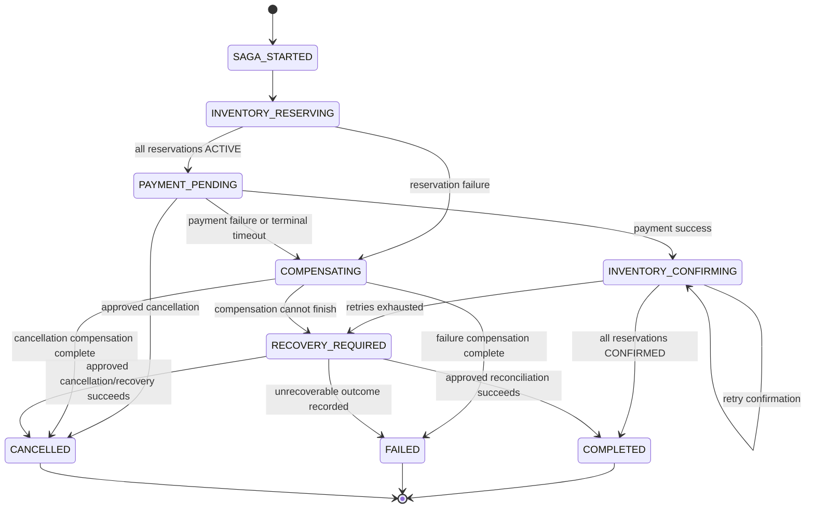
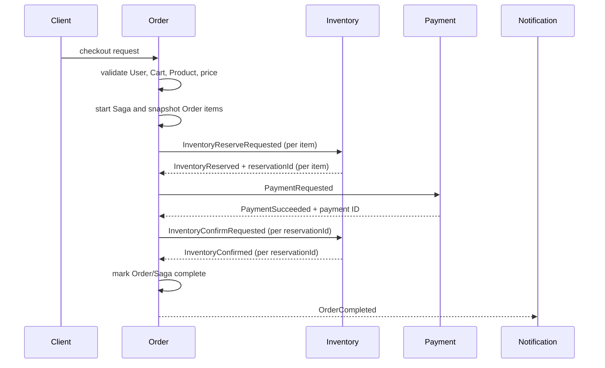

# Final Saga State Machine (Proposed)

**Status:** Design proposal for team review and approval. This document does not implement Saga, Kafka, retries, compensation, new APIs, schema changes, or configuration changes.

**Source of truth:** the current `main` branch and `docs/integration-review-and-saga-boundary-analysis.md`. Existing implementation details are called out as current behavior; all future commands, events, states, and persistence are proposed.

## 1. Scope and Boundaries

The proposed workflow is an Order-centered orchestration Saga. It is not a distributed transaction: each service commits its own local state, and Order coordinates forward actions and compensation.

| Service | Proposed role | Saga boundary |
|---|---|---|
| Order | Saga coordinator and owner of customer-facing Order and Saga state | Core participant; starts the workflow, records progress, coordinates compensation, and publishes terminal integration events |
| Inventory | Reservation and confirmation participant | Core participant; creates `ACTIVE` reservations, releases them during compensation, and confirms them after payment |
| Payment | Payment and refund participant | Core participant; processes payment and refunds a successful payment when an approved recovery or cancellation path requires it |
| Notification | Downstream consumer | Outside the core Saga; consumes `OrderCompleted` or `OrderCancelled` independently after the business outcome |
| Product | Product existence and price authority | Supporting service outside the core Saga; used for synchronous validation/snapshotting |
| Cart | Active cart and item snapshot source | Supporting service outside the core Saga; does not own checkout reservations |
| User | Identity and account authority | Supporting service outside the core Saga; validates identity before or at Saga start |

Product, Cart, and User have no compensating mutation in this workflow. Notification failure must not release inventory or refund a completed order.

## 2. Proposed Overall Saga States

These are Saga-level states, separate from the current Java `OrderStatus` enum. Names are proposed and require approval.

| Saga state | Meaning | Next states | Terminal? | Retry/recovery |
|---|---|---|---|---|
| `SAGA_STARTED` | Identity, cart, product, and price validation passed; Order snapshot and Saga were created | `INVENTORY_RESERVING`, `FAILED`, `CANCELLED` | No | Recover from restart; retry only the pending coordinator action |
| `INVENTORY_RESERVING` | One or more item reservations are being requested | `PAYMENT_PENDING`, `COMPENSATING`, `FAILED` | No | Retry retryable reserve failures; stop new work after a terminal item failure |
| `PAYMENT_PENDING` | All required reservations are `ACTIVE`; payment is requested or awaiting a result | `INVENTORY_CONFIRMING`, `COMPENSATING`, `FAILED`, `CANCELLED` | No | Retry according to approved payment policy and idempotency rules |
| `INVENTORY_CONFIRMING` | Payment succeeded; each reservation is being confirmed by exact `reservationId` | `COMPLETED`, `RECOVERY_REQUIRED`, `COMPENSATING`, `FAILED` | No | Retry confirmation; after exhaustion use the approved recovery path |
| `COMPLETED` | Required inventory confirmations and payment outcome are complete | None | Yes | No Saga retry; publish `OrderCompleted` reliably and let Notification recover independently |
| `COMPENSATING` | Releasing active reservations and, where approved, refunding payment | `FAILED`, `CANCELLED`, `RECOVERY_REQUIRED` | No | Retry each pending compensation operation until resolved or operator recovery |
| `FAILED` | Business workflow could not complete; failure and compensation outcome are recorded | None, except an explicitly approved recovery operation | Yes when all required compensation is resolved | May require operator reconciliation if compensation is unresolved |
| `CANCELLED` | Cancellation was accepted and required release/refund work is complete | None | Yes | Retry pending cancellation compensation before declaring terminal |
| `RECOVERY_REQUIRED` | Automatic processing cannot safely decide or finish, especially after payment success and confirmation failure | `COMPLETED`, `CANCELLED`, `FAILED` | No | Operator or approved recovery workflow; no automatic refund strategy is assumed here |

A Saga is not complete merely because Payment succeeds. `COMPLETED` is reached only after every required Inventory reservation is confirmed.

### Overall transition diagram

## 3. Order State Machine

### 3.1 Current status values

The current Order service defines `PENDING`, `CREATED`, `CONFIRMED`, `PAID`, and `CANCELLED`. The current create path saves `PENDING`, and current Payment success does not update it. Current cancellation changes local status only and does not release Inventory or refund Payment. The proposal below must not be interpreted as a code change to these values.

### 3.2 Proposed meanings

The team must approve the exact mapping between Saga states and existing Order statuses. One conservative interpretation is:

| Existing Order status | Proposed Saga-facing meaning | Notes |
|---|---|---|
| `PENDING` | Order accepted and Saga work is in progress | Fits the current create behavior; may cover reservation/payment/confirmation while work is pending |
| `CREATED` | Order record exists after validation/snapshot, before all workflow steps finish | Exact distinction from `PENDING` is unresolved |
| `PAID` | Payment succeeded | Not sufficient for business completion; Inventory confirmation is still required |
| `CONFIRMED` | Required Inventory confirmations succeeded and the order is complete | Candidate completion status, subject to approval |
| `CANCELLED` | Cancellation or failed workflow has been finalized with required compensation | Do not set it before required compensation handling is recorded |

An implementation may need a separate durable Saga state rather than overloading these existing statuses. No existing status is silently renamed or changed by this document.

### 3.3 Valid proposed transitions

| From | Trigger | To | Conditions |
|---|---|---|---|
| New order | Validation and Saga start | `PENDING` or approved initial status | User, cart, product, and price checks passed |
| `PENDING`/`CREATED` | All reservations succeed and payment succeeds | `PAID` or approved in-progress status | Payment result is recorded; order is not complete yet |
| `PAID`/in-progress | All reservations confirm | `CONFIRMED` or approved completed status | Every item reservation is `CONFIRMED` |
| In-progress | Non-retryable failure after work began | `CANCELLED` or approved failed status | Compensation is complete or a recovery outcome is recorded |
| In-progress | User cancellation | `CANCELLED` | State-specific release/refund rules are applied |
| `CONFIRMED` | Cancellation | `CANCELLED` | Refund rules and any remaining active reservation handling are approved and completed |
| Terminal status | Any normal forward transition | None | Terminal states cannot silently resume |

Successful completion is the transition to the approved completed Order status only after payment and required Inventory confirmations. Failure records the reason and compensation result. Cancellation is a state-aware Saga operation, not only a local status update.

## 4. Inventory Reservation State Machine

The existing Reservation model has exactly these states: `ACTIVE`, `RELEASED`, and `CONFIRMED`.

| State | Meaning | Allowed transition |
|---|---|---|
| `ACTIVE` | Reservation was created and reserved quantity is held | `RELEASED` for compensation/cancellation, or `CONFIRMED` after payment |
| `RELEASED` | Held quantity was returned; reservation can no longer be confirmed | Terminal |
| `CONFIRMED` | Reserved quantity was consumed; reservation can no longer be released | Terminal |

### 4.1 Reservation operations

1. Order requests one reservation per Order item, carrying `sagaId`, `orderId`, `productId`, and quantity.
2. Inventory creates the reservation with a generated `reservationId` and status `ACTIVE`; the returned ID is durably associated with that item before the Saga advances.
3. `orderId` is optional in the current Reservation model, but the proposed Saga should supply it when an Order exists. `sagaId` and item correlation are also proposed metadata.
4. After Payment success, Order requests confirmation by the exact `reservationId` for every item.
5. During compensation or cancellation, Order requests release by the exact `reservationId` for every reservation that is still `ACTIVE`.
6. Quantity-based release/confirmation is not suitable for Saga compensation because it cannot identify the reservation belonging to this Order.

A repeated release or confirmation against a non-`ACTIVE` reservation is currently an invalid operation. The future contract must make duplicate delivery safe through idempotency or prior-result lookup while preserving the invariant that a reservation cannot be both `RELEASED` and `CONFIRMED`.

## 5. Payment State Machine

The current Payment model has `PENDING`, `SUCCESS`, `FAILED`, and `REFUNDED`. `REFUND_PENDING` is proposed for the Saga because refund is an asynchronous or recoverable compensation step even though it does not exist in the current enum.

| Payment state | Meaning | Proposed transitions | Terminal? |
|---|---|---|---|
| `PENDING` | Payment request accepted and outcome is not final | `SUCCESS` or `FAILED` | No |
| `SUCCESS` | Payment was successfully processed/captured according to the approved provider contract | `REFUND_PENDING` when approved compensation is required | No if refund may be required |
| `FAILED` | Payment did not succeed and no successful payment exists | None | Yes for this attempt; Saga may retry with an approved idempotency policy |
| `REFUND_PENDING` | A successful payment requires compensation and refund is requested/in progress | `REFUNDED` or recovery-required outcome | No |
| `REFUNDED` | Successful payment was compensated | None | Yes |

Normal payment failure is a forward-step failure: release active Inventory reservations and fail/cancel the Saga. Refund is a separate compensation path after Payment success. The existing review supports refund of a successful payment, but does not define an automatic refund strategy for payment success followed by Inventory confirmation failure.

## 6. Happy Path

The proposed sequence is:

`Order validates identity/cart/product/price -> Saga starts -> Inventory reservations -> Payment -> Inventory confirmation -> Order completed -> OrderCompleted event -> Notification`.

For multiple Order items, every successful reservation response must retain its own `reservationId`, associated with the corresponding product and quantity. Confirmation and compensation must iterate those exact references; one shared product/quantity value is insufficient.

## 7. Failure and Compensation Paths

### 7.1 Inventory reservation failure

If one item reservation fails:

1. Stop issuing new reservation commands for the failed Saga.
2. Record `InventoryReservationFailed` with reason and retryability.
3. For each earlier successful reservation still `ACTIVE`, issue `InventoryReleaseRequested` using that reservation's exact `reservationId`.
4. Persist each `InventoryReleased` result and retry unresolved releases according to the approved recovery policy.
5. After compensation/recovery handling is complete, mark the Saga failed and set the approved failed/cancelled Order status. Publish `OrderCancelled` if that is the approved terminal integration event.

A failed reservation must not cause release by product ID and quantity, because that could release another order's reservation.

### 7.2 Payment failure

The intended path is:

`Inventory reservations succeed -> Payment fails -> release all ACTIVE reservations -> Saga/Order reaches failed state`.

Payment failure does not require a refund when no successful payment exists. A retryable Payment failure may remain pending while the approved retry policy is applied; a terminal failure starts Inventory compensation.

### 7.3 Payment success followed by Inventory confirmation failure

This is a recovery case:

`Payment succeeds -> Inventory confirmation fails -> retry confirmation -> if retry succeeds, complete Order -> if retries are exhausted, enter RECOVERY_REQUIRED or the approved recovery path`.

The recovery path must not silently mark the Order complete. The existing review supports durable retry and operator-assisted reconciliation, and identifies possible release-plus-refund as a decision. It does **not** approve an automatic refund strategy. Therefore, whether to refund Payment, release any still-active reservations, keep payment/order state for manual reconciliation, or allow another controlled action requires team approval.

### 7.4 Cancellation

Cancellation is evaluated against the current Saga, Order, Inventory, and Payment states.

| Cancellation timing | Required handling |
|---|---|
| Before payment | Stop forward processing. Release any reservations already created; no refund is needed. Finish as `CANCELLED` after release/recovery handling. |
| After Inventory reservation but before payment result | Do not start payment if cancellation wins the race. Release every `ACTIVE` reservation by ID. If payment was already requested, reconcile its result using the approved idempotency/cancellation policy. |
| After payment success | Determine each reservation state. Release only reservations still `ACTIVE`; do not release `CONFIRMED` reservations. Request a refund for the successful payment where the approved payment policy allows it, and record `REFUND_PENDING` until resolved. Finish cancellation only after required compensation or an approved recovery outcome. |
| After completion | Treat as a post-completion cancellation/refund workflow. It is outside the forward Saga and needs an approved business policy. |

`OrderCancelled` is a proposed integration event and must summarize the cancellation and compensation outcome without exposing an unresolved operation as successful.

## 8. Proposed Command and Result Family

The following names come from the integration review. They are **PROPOSED contracts, not implemented contracts**. They may be commands or results carried by separate topics or another approved transport; no Kafka topics currently exist.

| Contract | Direction | Purpose |
|---|---|---|
| `OrderCheckoutStarted` | Order -> workflow consumers | Announces a started checkout and Order snapshot |
| `InventoryReserveRequested` | Order -> Inventory | Reserve one item |
| `InventoryReserved` | Inventory -> Order | Reports `ACTIVE` reservation and `reservationId` |
| `InventoryReservationFailed` | Inventory -> Order | Reports reservation failure and retryability |
| `InventoryReleaseRequested` | Order -> Inventory | Release one exact reservation for compensation |
| `InventoryReleased` | Inventory -> Order | Reports release result |
| `PaymentRequested` | Order -> Payment | Process payment with correlation and idempotency data |
| `PaymentSucceeded` | Payment -> Order | Reports successful payment, payment ID, and provider reference |
| `PaymentFailed` | Payment -> Order | Reports failure and retryability |
| `PaymentRefundRequested` | Order -> Payment | Request compensation for a successful payment |
| `PaymentRefunded` | Payment -> Order | Reports completed refund |
| `InventoryConfirmRequested` | Order -> Inventory | Confirm one exact reservation |
| `InventoryConfirmed` | Inventory -> Order | Reports confirmed reservation |
| `OrderCompleted` | Order -> Notification/integrations | Announces completed business outcome; outside the core Saga |
| `OrderCancelled` | Order -> Notification/integrations | Announces cancelled/failed outcome; outside the core Saga |

## 9. Correlation and Identity

Every proposed message should carry an `eventId` or `commandId` and enough correlation to identify the workflow:

| Identifier | Purpose |
|---|---|
| `sagaId` | Server-generated identity for one orchestration attempt/workflow |
| `orderId` | Business identity of the Order; links participant records to the Order |
| Event/command ID | Unique identity of one message for deduplication and result tracing |
| `reservationId` | Exact Inventory reservation identity returned for each item |
| Payment ID | Payment record identity; paired with provider transaction/reference where available |
| Participant operation/idempotency key | Stable identity for one reserve, release, confirm, payment, or refund operation |

The proposed messages should also carry the relevant product ID, quantity, user ID, amount, currency, reason/code, and attempt metadata. A separate `sagaId` is useful even when `orderId` is present because it identifies the workflow context and supports retries/recovery without treating a client-supplied Order ID as authority.

`reservationId` is required for exact compensation: product ID plus quantity cannot distinguish this Order's reservation from another concurrent Order's reservation. The coordinator must persist the ID returned by Inventory before it can safely request release or confirmation.

## 10. Retry, Idempotency, and Recovery Expectations

These are design expectations only; no mechanism exists today.

- **Duplicate commands/events:** handlers should use event/command IDs and stable business/operation keys to return the prior result or safely no-op. A duplicate reserve or payment request must not create a second business effect.
- **Retryable failures:** transport errors, timeouts, temporary service unavailability, and explicitly retryable participant failures may be retried with persisted attempt state and approved backoff.
- **Non-retryable failures:** invalid input, missing resources, insufficient stock, invalid terminal state, authorization failure, and other explicit business conflicts should stop the forward step and begin the applicable failure or compensation path.
- **Timeout/restart recovery:** Saga state and pending operations must be durable so Order can resume or reconcile after a process restart. A timeout must not be treated as proof that a remote operation did not commit.
- **Inventory release/confirmation:** operations must be idempotent by exact `reservationId` and operation key. Repeated delivery must never double-decrement or double-release quantity.
- **Payment idempotency:** Payment processing and refund requests require a stable operation key and a deterministic lookup of an existing payment/result. The key must prevent duplicate charges or duplicate refunds.
- **Compensation retry:** unresolved release or refund work remains visible as pending/recovery-required; it is not considered complete because a request was sent.
- **Notification recovery:** Notification retries and dead-letter/manual recovery are independent from Saga completion.

Retry count, backoff, timeout, and dead-letter details are unresolved decisions listed below.

## 11. Durable Persistence Requirements

The future coordinator will need durable Saga state, at minimum:

- `sagaId` and `orderId`.
- Current step and overall Saga state.
- Order state/status and item snapshot relevant to the workflow.
- Attempt count, last attempt, next retry time, and created/updated/completed timestamps.
- Failure reason, retryability, and compensation/recovery outcome.
- Payment reference, Payment ID, provider reference, and payment status.
- One reservation reference per Order item: product ID, quantity, `reservationId`, and reservation state.
- Participant operation/idempotency keys and received command/event IDs where deduplication is needed.

The review also identifies an outbox or equivalent reliable event-publication mechanism. It is needed so a committed state transition and its command/result/integration event are not split by a crash. Consumer inbox/deduplication and reconciliation records are also expected design concerns, but none are implemented yet.

## 12. Invariants

The approved implementation must preserve these invariants:

1. An Inventory reservation cannot be both `RELEASED` and `CONFIRMED`; an `ACTIVE` reservation transitions to at most one of them.
2. Inventory quantity must not be double-decremented. Confirmation consumes the reservation exactly once.
3. Compensation must target the correct `reservationId`, never an ambiguous product/quantity pair.
4. Successful Payment does not automatically mean the Order is completed.
5. Order completion occurs only after required Inventory confirmation for every item.
6. Duplicate messages must not create duplicate reservations, payments, refunds, releases, confirmations, or terminal events.
7. A failed or cancelled Saga must not report successful completion.
8. A compensation operation is complete only after its result is durably recorded or an approved recovery state explicitly owns the unresolved work.
9. Notification failure cannot undo a completed business transaction.
10. Each Order item retains its own reservation reference and cannot accidentally use another item's reservation.

## Decisions Requiring Team Approval

The following remain unresolved in the existing documentation and are intentionally not finalized here:

- Exact Order status names and the mapping between existing `PENDING`, `CREATED`, `PAID`, `CONFIRMED`, and `CANCELLED` values and the proposed Saga states.
- Retry count, backoff algorithm, maximum elapsed time, and timeout values for each participant operation.
- Kafka topic names, command/result topic separation, retention, partition/key strategy, and delivery semantics.
- Event schema ownership, compatibility/versioning, required payload fields, and event publication ordering.
- Dead-letter queue strategy, alerting, replay, and operator permissions.
- Exact recovery behavior after Payment success followed by exhausted Inventory confirmation retries: automatic refund/release, operator-assisted reconciliation, or another approved policy.
- Whether Payment represents one payment per Order, and the precise authorize/capture/refund lifecycle for a real provider.
- Reservation expiry policy and how abandoned `ACTIVE` reservations are reconciled.
- Cancellation race rules when a payment or reservation command is already in flight.
- Checkout price snapshot semantics when Cart price and current Product price differ.
- Authentication and service-to-service authorization, including how user identity and correlation are propagated without trusting arbitrary client-supplied identifiers.
- Exact outbox/inbox and durable reconciliation design.
- Final Notification event payload and its independent retry/DLQ policy.

Until these decisions are approved, the proposed contracts and state names should be treated as review artifacts rather than implementation commitments.
